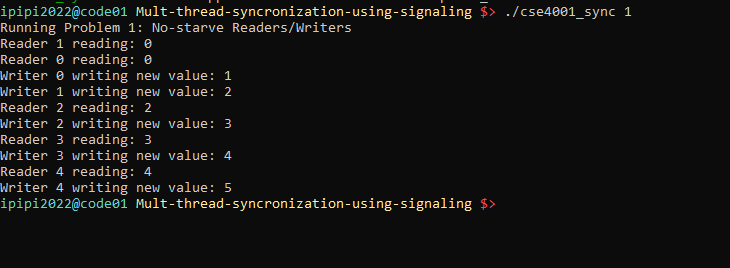
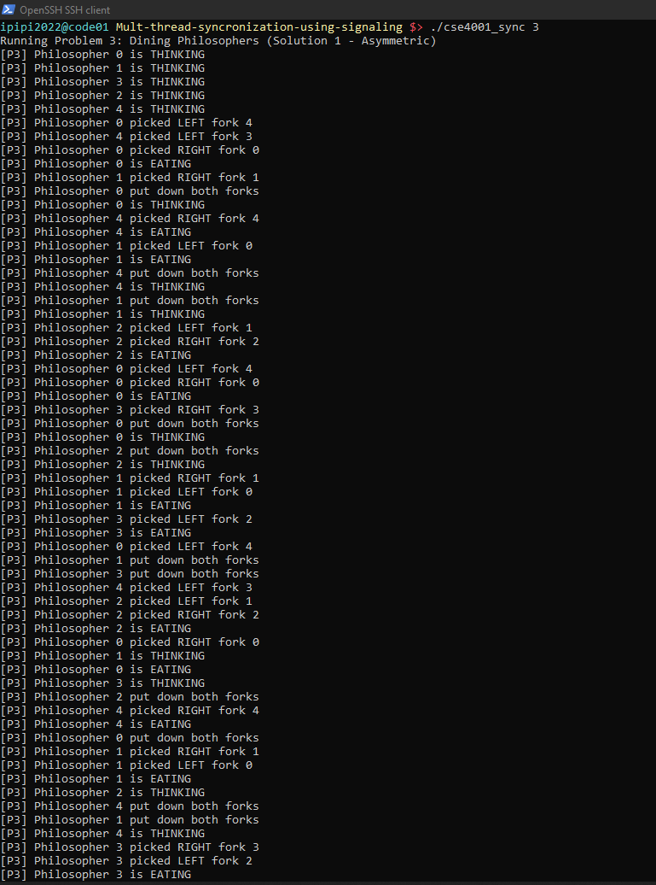
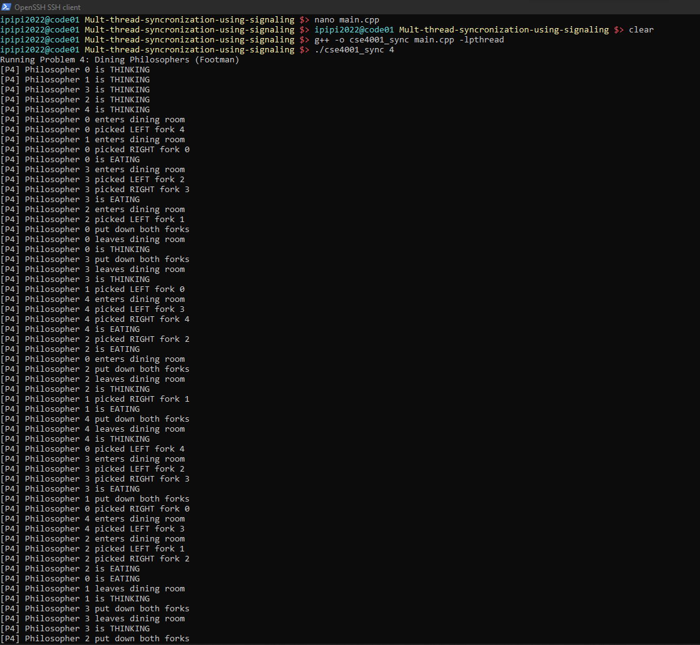
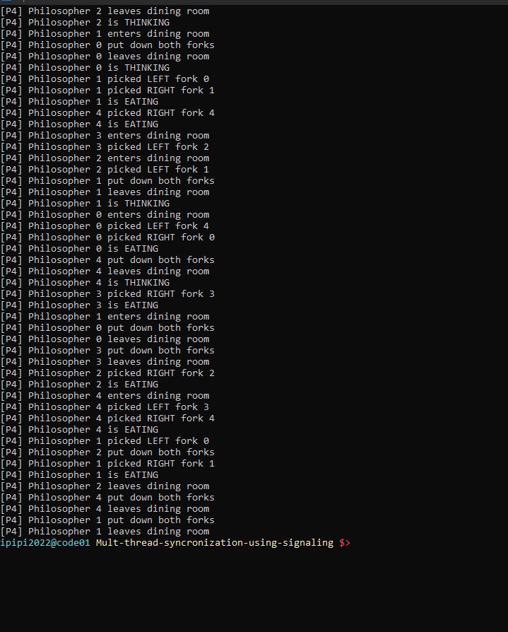

# Multi-thread Synchronization Using Signaling

This project implements classic synchronization problems using POSIX semaphores and threads in C++. It demonstrates solutions to common concurrent programming challenges including readers-writers synchronization and the dining philosophers problem.

## Overview

The project contains four complete implementations:

1. **No-Starve Readers-Writers** - Fair solution preventing writer starvation
2. **Writer-Priority Readers-Writers** - Writers get priority over readers
3. **Dining Philosophers (Asymmetric)** - Deadlock prevention using asymmetric fork picking
4. **Dining Philosophers (Footman)** - Deadlock prevention using a resource limiter

Each problem demonstrates different synchronization strategies and deadlock/starvation prevention techniques.

## Problems Implemented

### Problem 1: No-Starve Readers-Writers

A solution to the readers-writers problem that prevents writer starvation. This implementation uses three semaphores to ensure fair access:

- **turnstile**: Acts as a "door" that writers can close to prevent new readers from entering
- **roomEmpty**: Indicates whether the critical section is empty (no readers inside)
- **mutex_r**: Protects the reader count variable

#### How It Works

**Readers:**
1. Pass through the turnstile (immediately signal it back)
2. Use a lightswitch pattern to track reader count
3. First reader locks roomEmpty, last reader unlocks it
4. Read the shared data

**Writers:**
1. Lock the turnstile (preventing new readers)
2. Wait for the room to be empty (all current readers finish)
3. Write to shared data
4. Release both roomEmpty and turnstile

This ensures writers don't starve since they can block new readers from entering while waiting for current readers to finish.

#### Example Output



The output shows readers and writers accessing shared data in a synchronized manner, with writers incrementing the value and readers reading it.

### Problem 2: Writer-Priority Readers-Writers

A solution to the readers-writers problem that gives priority to writers. When a writer arrives, it prevents new readers from entering, ensuring writers get timely access to the shared resource.

This implementation uses three semaphores:

- **writerGate**: Controls access for writers and blocks readers when writers are waiting
- **noWriters**: Ensures no writers are active when readers are reading
- **rmutex**: Protects the reader count variable

#### How It Works

**Readers:**
1. Pass through the writerGate (immediately signal it back)
2. Use a lightswitch pattern to track reader count
3. First reader locks noWriters to prevent writers from entering
4. Read the shared data
5. Last reader unlocks noWriters to allow writers

**Writers:**
1. Lock the writerGate (preventing new readers from entering)
2. Wait for noWriters (ensuring no readers are currently reading)
3. Write to shared data
4. Release noWriters
5. Release writerGate

This ensures writers get priority since they lock the writerGate, blocking any new readers from starting while they wait for current readers to finish.

#### Example Output


The output demonstrates that writers get prioritized access to the shared resource, preventing reader starvation of writers.

### Problem 3: Dining Philosophers (Asymmetric Solution)

A classic synchronization problem where 5 philosophers sit at a round table with 5 forks (one between each pair of philosophers). Each philosopher alternates between thinking and eating, but needs both adjacent forks to eat. The challenge is to prevent deadlock where all philosophers pick up one fork and wait forever for the second.

This implementation uses an **asymmetric solution** to prevent deadlock:

- **5 Semaphores (forks)**: One semaphore per fork, each initialized to 1
- **Asymmetric fork picking**: Even-numbered philosophers pick LEFT then RIGHT, odd-numbered philosophers pick RIGHT then LEFT

#### How It Works

**Even Philosophers (0, 2, 4):**
1. Think for a period
2. Pick up LEFT fork first
3. Pick up RIGHT fork second
4. Eat
5. Put down both forks

**Odd Philosophers (1, 3):**
1. Think for a period
2. Pick up RIGHT fork first
3. Pick up LEFT fork second
4. Eat
5. Put down both forks

**Why This Prevents Deadlock:**

The asymmetric ordering breaks the circular wait condition. If all philosophers try to pick up forks simultaneously:
- Even philosophers grab their left forks
- Odd philosophers grab their right forks
- At least one philosopher will successfully acquire both forks and proceed to eat

This is different from the naive solution where all philosophers pick up the same fork first (e.g., left), which can lead to deadlock where everyone holds one fork and waits for the second.

Each philosopher eats 3 times in this implementation, demonstrating that the solution allows progress without deadlock or starvation.

#### Example Output




The output shows all 5 philosophers successfully thinking, picking up forks, eating, and putting down forks multiple times without deadlock. The asymmetric strategy ensures progress is always possible.

### Problem 4: Dining Philosophers (Footman Solution)

An alternative solution to the Dining Philosophers problem using a "footman" approach. The footman is represented by a semaphore that limits the number of philosophers who can attempt to pick up forks simultaneously.

This implementation uses:

- **5 Fork Semaphores**: One semaphore per fork, each initialized to 1
- **Footman Semaphore**: Initialized to 4, allowing only 4 philosophers at the table at once

#### How It Works

**All Philosophers:**
1. Think for a period
2. Wait for the footman (get permission to enter dining room)
3. Pick up LEFT fork
4. Pick up RIGHT fork
5. Eat
6. Put down both forks
7. Signal the footman (leave dining room)

**Why This Prevents Deadlock:**

By limiting the number of philosophers at the table to 4 (one less than the total number of philosophers), we guarantee that at least one philosopher can always acquire both forks. With only 4 philosophers at the table and 5 forks available, it's impossible for all seated philosophers to hold exactly one fork each.

This solution is simpler than the asymmetric approach since all philosophers follow the same fork-picking pattern. The footman semaphore acts as a gatekeeper to ensure the system never enters a deadlock state.

Each philosopher eats 3 times, demonstrating deadlock-free operation.

#### Example Output





The output shows philosophers requesting permission from the footman, entering the dining room, eating, and leaving. Notice how no more than 4 philosophers are in the dining room at any time, preventing deadlock.

## Building and Running

### Compilation

```bash
make
```

Or manually:
```bash
g++ -g main.cpp -o cse4001_sync -lpthread -lm
```

### Execution

Run Problem 1 (No-Starve Readers-Writers):
```bash
./cse4001_sync 1
```

Run Problem 2 (Writer-Priority Readers-Writers):
```bash
./cse4001_sync 2
```

Run Problem 3 (Dining Philosophers - Asymmetric):
```bash
./cse4001_sync 3
```

Run Problem 4 (Dining Philosophers - Footman):
```bash
./cse4001_sync 4
```

### Cleaning

```bash
make clean
```

## Code Structure

- `main.cpp` - Main implementation with reader/writer threads and problem logic
- `semaphore_class.h` - Semaphore wrapper class for POSIX semaphores
- `makefile` - Build configuration

## Requirements

- C++ compiler with C++11 support
- POSIX threads library (pthread)
- POSIX semaphores (semaphore.h)

## Implementation Details

**Problems 1 & 2:**
- 5 reader threads and 5 writer threads
- Shared integer variable that writers increment and readers read
- Semaphore-based synchronization to prevent race conditions and starvation

**Problem 3:**
- 5 philosopher threads
- 5 fork semaphores (one per fork)
- Each philosopher eats 3 times
- Asymmetric fork-picking strategy to prevent deadlock

**Problem 4:**
- 5 philosopher threads
- 5 fork semaphores (one per fork)
- 1 footman semaphore (limits to 4 philosophers at table)
- Each philosopher eats 3 times
- Footman approach to prevent deadlock
